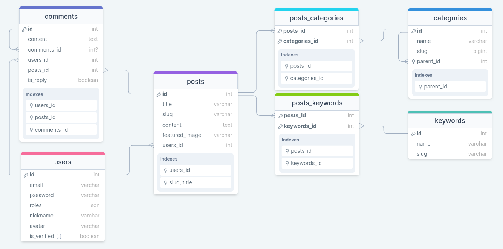
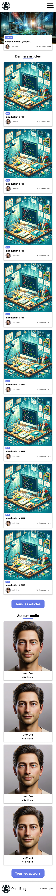
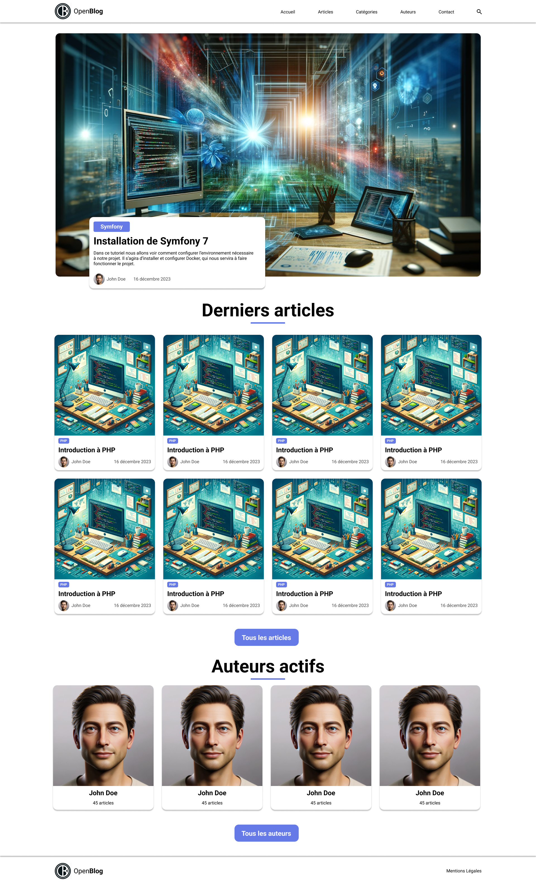
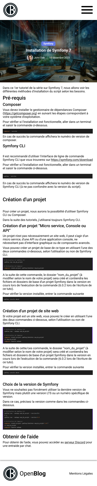
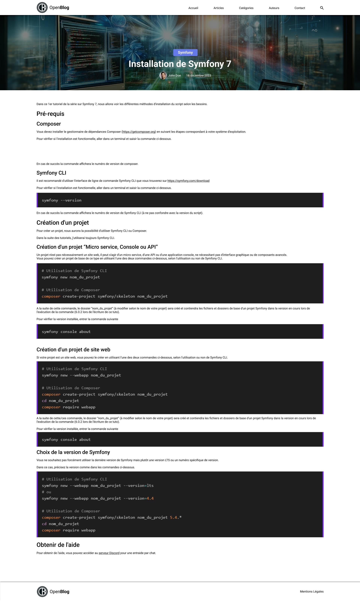

# Sommaire
- [Sommaire](#sommaire)
- [Le projet](#le-projet)
  - [Technologies](#technologies)
  - [Base de données](#base-de-données)
  - [Vidéos](#vidéos)
  - [Maquettes](#maquettes)
    - [Page d'accueil](#page-daccueil)
      - [Mobile](#mobile)
      - [Desktop](#desktop)
    - [Page d'un article](#page-dun-article)
      - [Mobile](#mobile-1)
      - [Desktop](#desktop-1)

# Le projet

Open**Blog** est un **blog multi auteurs** créé avec **Symfony 7** dans une série de tutoriels présents sur la chaîne **Nouvelle-Techno.fr** à cette adresse : https://www.youtube.com/playlist?list=PLBq3aRiVuwywmwPHz0BzPFvH0P-37mH8K

## Technologies

Open**Blog** sera développé en utilisant :

- Docker
- Symfony 7
- Mysql 8.0
- PHP 8.2
- PHPMyAdmin
- Sass

L'utilisation de bundles sera limitée au strict nécessaire.

## Base de données
Vous trouverez le **schéma de base de données** ici : https://drawsql.app/teams/ma-team-7/diagrams/blog-symfony-7

## Vidéos

1. [Présentation et configuration du projet](https://www.youtube.com/watch?v=isyfqqizOGI&list=PLBq3aRiVuwywmwPHz0BzPFvH0P-37mH8K) ([Commit Github](https://github.com/NouvelleTechno/OpenBlog/tree/b27fccc6600867f5371a272a7b708037bd725e52))
2. [Introduction sur les contrôleurs](https://www.youtube.com/watch?v=WRg6msiB87g&list=PLBq3aRiVuwywmwPHz0BzPFvH0P-37mH8K) ([Commit Github](https://github.com/NouvelleTechno/OpenBlog/tree/3f1f388484a3e437af17601ee8084ed5149821a8))
3. [Les templates et Assets](https://www.youtube.com/watch?v=TfESYhlcIrU&list=PLBq3aRiVuwywmwPHz0BzPFvH0P-37mH8K) ([Commit Github](https://github.com/NouvelleTechno/OpenBlog/tree/f0f6fc7aabded4f223148ad2d3333fa6ac700041))
4. [Création de la base de données](https://www.youtube.com/watch?v=SM1TZuvAs-M&list=PLBq3aRiVuwywmwPHz0BzPFvH0P-37mH8K) ([Commit Github](https://github.com/NouvelleTechno/OpenBlog/tree/f35223baf26b3a06d8d1ca87557d810fd3bf2c39))
5. [Inscription et Authentification des utilisateurs](https://www.youtube.com/watch?v=zXCeT2dGUOY&list=PLBq3aRiVuwywmwPHz0BzPFvH0P-37mH8K) ([Commit Github](https://github.com/NouvelleTechno/OpenBlog/tree/61072795e6b6030de97fc495b4bb73bdbfb05234))
6. [Envoi du mail de confirmation du compte des utilisateurs](https://www.youtube.com/watch?v=p3Fr6ekX3Fo&list=PLBq3aRiVuwywmwPHz0BzPFvH0P-37mH8K) ([Commit Github](https://github.com/NouvelleTechno/OpenBlog/tree/b6e4588c46824c2dce2ce23fd8d5940bdc529a8f))
7. A venir

## Maquettes

Les maquettes sont disponibles sur [Figma](https://www.figma.com/file/WBF5w0A2qQ6qCfcMPP4Per/OpenBlog?type=design&node-id=0%3A1&mode=design&t=Fm5lnbz8ojK7uSlb-1)

### Page d'accueil

#### Mobile

#### Desktop

### Page d'un article

#### Mobile

#### Desktop

